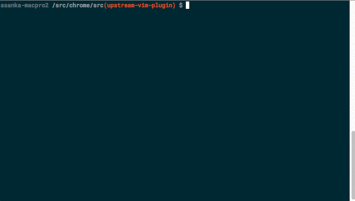
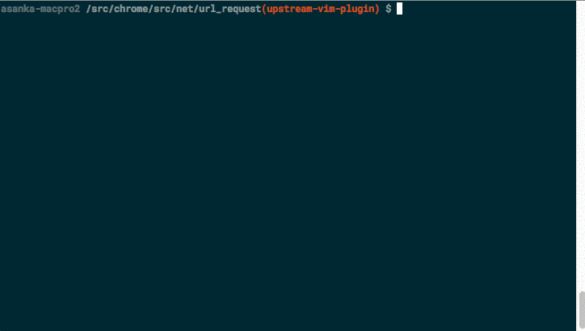
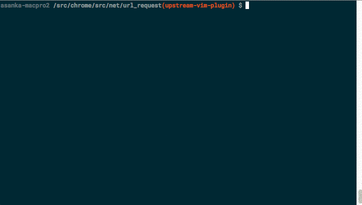
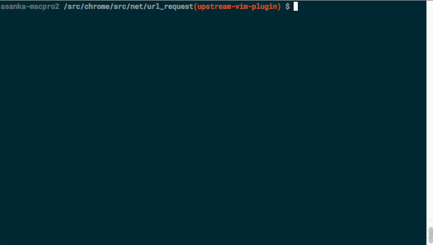

Chromium Codesearch Plugin for Vim
==================================

Integrates Chromium CodeSearch into Vim. When combined with additional plugins
(e.g. [vim-fugitive](https://github.com/tpope/vim-fugitive)) should make it
totally unnecessary to leave your editor to visit https://cs.chromium.org.

Examples of what's currently possible:

* Search from within Vim and visit a rendered search results buffer. E.g.: Type
  `:CrSearch` *your search term* from any buffer to see the results of searching
  for *your search terms* on CodeSearch. Hit `<Enter>` to visit the
  corresponding file in the local working directory.

  

* Look up cross references for the symbol under the cursor by invoking
  `:CrXrefSearch` from a buffer corresponding to a Chromium source file. The
  crossreferences are displayed in a new buffer which allows navigation to
  corresponding files in the local working directory.

  

* Look up the call graph for a symbol under the cursor by invoking
  `:CrCallgraph`. The graph can be expanded incrementally and support navigation
  similar to other rendered buffers.

  

* Load all possible call targets for a function call under the curser into the
  quickfix list.

  

* And more!

Caveats
-------

The index at https://cs.chromium.org is updated regularly. The cross reference
information is only accurate to the extent that your working directory matches
what was indexed. If they diverge, you may notice that the jump targets don't
match the snippets displayed, or worse, cross references are incorrect.

Installation
------------

Use your favorite plugin manager. E.g.:

* [Vundle](https://github.com/VundleVim/Vundle.vim):

```viml
call vundle#begin()
" Other plugins
Plugin 'chromium/vim-codesearch'
" More plugins
call vundle#end()
```

* [vim-plug](https://github.com/junegunn/vim-plug)

```viml
call plug#begin()
" Other plugins
Plug 'chromium/vim-codesearch'
" More plugins
call plug#end()
```

It's highly recommended that you add the following to your `.vimrc` file
(assuming that you've checked out Chromium into `/src/chrome/src`):

```viml
let g:codesearch_source_root = '/src/chrome'
```

I.e. `g:codesearch_source_root` should point to the directory above `src`. This
is also the directory containing your `.gclient` file. Setting
`g:codesearch_source_root` in the `.vimrc` file allows the plugin to locate the
Chromium checkout regardless of the current directory.


Documentation
-------------

Once installed, you should be able to run `:help crcs.txt` to view the help
file. As with all Vim plugins, all documentation should go there.

Contributing
------------

**NOTE**: This is not an official Google product.

See [CONTRIBUTING](./CONTRIBUTING.md).

[](https://travis-ci.org/chromium/vim-codesearch)

BUGS
----

File bugs at https://github.com/chromium/vim-codesearch

